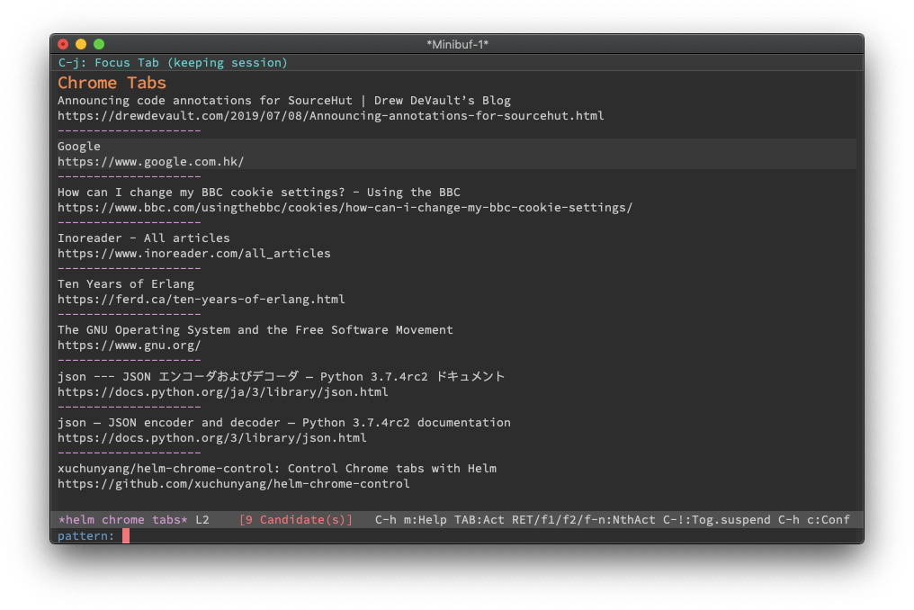

# Control Chrome tabs with Helm

`M-x helm-chrome-control` displays chrome tabs and let you control them:

e.g., you can focus tab, close tab, copy the title & URL of the tab, etc.

## Requirements

- macOS >= 10.10 for JavaScript for Automation (JXA)
- Emacs >= 25.1 for `let-alist` and `alist-get`

## Customization

### `helm-chrome-control-actions`

Actions for the command `helm-chrome-control`. Defaults to

1. Focus Tab
2. Close Tab
3. Copy URL
4. Copy Title
5. Open URL in EWW

## Acknowledgement

`chrome.js` is from Renan Cakirerk's [chrome-control](https://github.com/bit2pixel/chrome-control).
